# eVTOL Patent Taxonomy & Embedding Structure — Progress Report

**Prepared for:** Phase Supervisor
**Pipeline stage:** `11_taxonomy_structure_separation.ipynb` (Batches 01 + 05, 1639-patent dataset), model `facebook/dinov2-large` (frozen), layers {18, 22, 24} × pooling {cls, mean_patch}

---

## Section 1: Batches & Architecture Baseline Analysis

<strong>What this stage checks:</strong> whether the raw review spreadsheets and the downstream processed manifests agree with each other end-to-end (no patents lost or double-counted between review, duplicate-filtering, and architecture extraction), and which DINOv2 layer/pooling configuration the rest of the report will standardize on.

All figures below are derived directly from the source review files (<code>Review_postprocess_Batch_01/05.xlsx</code>, patent-level <code>T1</code> section and architecture-level <code>T2</code> section, at <code>.../1639_DS/data/reviewed xlsxs/</code>) and the downstream processing manifests (<code>processing_manifest_Batch_01.csv</code>, <code>processing_manifest_Batch_05.csv</code>, at <code>.../1639_DS/data/processed/Batch_01/</code> and <code>.../Batch_05/</code>) plus the notebook's Stage 0 outputs.

### 1.1 Individual and Combined Batch High-Level Summary

| Metric | Batch_01 | Batch_05 | **Global / Combined** |
|---|---:|---:|---:|
| Total patents reviewed (patent-level, `T1`) | 352 | 211 | **563** |
| Patents disapproved (`isApproved=False`) | 60 | 871 | **147** |
| Patents approved (`isApproved=True`) | 292 | 123 | **415** |
| Total unique Patent IDs reviewed *and approved into the architecture stage* (`T2`)2 | 125 | 95 | **220** |
| Total architecture instances (approved, `T2` "arch" rows) | 3013 | 2303 | **531** |
| `is_main == True` images | 150 | 114 | **264** |

1 Batch_05 has one patent with an unresolved <code>isApproved</code> value (blank/incomplete review) — excluded from both the approved and disapproved counts above, so 123 + 87 + 1 = 211 reconciles exactly.

2 <strong>Why this can be lower than "approved patents":</strong> a patent only reaches the architecture (<code>T2</code>) stage after passing patent-level (<code>T1</code>) review as approved <em>and</em> non-duplicate; some approved-but-duplicate patents (e.g. Batch_01's 183 <code>isDuplicate=True</code> patents) are folded into an existing entry rather than creating a new architecture record, which is why 125/95 unique IDs is smaller than 292/123 approved patents.

3 <strong>Why architecture instances (301/230) exceed unique Patent IDs (125/95):</strong> a single patent can disclose more than one distinct aircraft configuration. Batch_01 has 14 multi-architecture patents (7 with 2 architectures, 3 with 3, 2 with 4, 2 with 5); Batch_05 has 12 (8×2, 2×3, 1×4, 1×5). This is expected and by design — it is <em>not</em> a data-quality issue.

**`is_main == True` cross-check:** 264 main images (150 + 114) against 268 total labelled architectures (Section 1.2) reconciles cleanly: 268 − 4 architectures with no approved main image = 264. The two counts match exactly once that known gap is accounted for. Documented in Stage 0's `qc_issues.csv`.

#### Duplicate-Type Definitions

The underlying review criteria are identical across both batches — same taxonomy schema (`G1`→`M3`), same image quality checks. When a reviewer flags a patent as a duplicate of one already in the dataset, it is tagged with one of three real categories (exact labels and counts from the `duplicateType` field, `META` section):

| Type (as labelled in the data) | Batch_01 | Batch_05 | Plain-language meaning |
|---|---:|---:|---|
| **"1 — Same Aircraft"** | 5 | 6 | Points to an aircraft/design already seen in the dataset, but this patent record is otherwise distinct enough to log separately (e.g. different filing). |
| **"2 — Images AND aircraft the same"** | 167 | 27 | True exact duplicate — same aircraft *and* the same drawings; contributes no new visual information. |
| **"3 — Same plane, small changes"** | 10 | – (0) | Same aircraft, but the drawings show minor variations (e.g. a revised figure, small structural tweak) worth keeping separately. |

The three types are defined by which taxonomy fields match between the two records: **Type 1** — `G1` through `M3` are equal. **Type 2** — `T2` through `M3` are equal. **Type 3** — all taxonomy stages differ. Type 2 accounts for the large majority of flagged duplicates in both batches (167 of 182 flagged in Batch_01, 27 of 33 in Batch_05) — most duplicate flags in this dataset are true exact repeats, not near-variants.

### 1.2 Global Batch Pipeline & Data Discrepancy Audit

Purpose: trace exactly where the 563 reviewed patents narrow down to the 264 images that actually get embedded, and account for every patent/architecture that drops out along the way.

This subsection tracks the same 563 reviewed patents as they narrow down through the notebook's Stage 0 (`tax.stage0_prepare`) into the final embedded dataset — i.e. where images are gained, dropped, or reshaped, and why.

| Pipeline Metric | Value |
|---|---:|
| `is_main == True` images (manifest, both batches) | **264** |
| Total architectures labelled | **268** |
| Base patents behind those architectures | 222 |
| Taxonomy attributes (distinct fields) tracked | **256** |
| Images with a fully aligned embedding | **264** |
| Architectures missing an approved main image | 4 |

#### Reconciling the Counts

**268 vs. 256:** these describe two different things, not two stages of the same count. **268** is a *row count* — one row per labelled aircraft configuration (architecture). **256** is a *column count* — the number of distinct taxonomy fields recorded per architecture (e.g. `M1_fusShape`, `M2_wingConf`, `M3_boom_bmech`, ...). Every architecture row carries all 256 attribute columns (populated or null). Confirmed via `stage0/coverage_table.csv`, `cov['attribute'].nunique() == 256`.

**268 vs. 264:** all architecture main images are embedded. The only 4 not embedded have no approved main image on disk, so there is nothing to extract an embedding from for them — `CN106585976A`, `KR102760903B1`, `US2018354616A1`, `US2022348339A1`. 268 − 4 = **264**, matching the `is_main == True` count in Section 1.1 (each of the 264 embedded architectures uses its own main image). Per `config.yaml`'s `taxonomy.main_arch_only: false` and `src/taxonomy_analysis.py:373-376`; the 4 missing images are listed in `qc_issues.csv` ("architecture without approved main image", n=4); the 264 rows match `aligned_rows.csv` exactly.

### 1.3 Optimal Layer and Patch Pooling Strategy Selection

Purpose: compare all 6 candidate DINOv2 layer × pooling configurations and decide which single one the rest of the analysis (Sections 3–4) will standardize on.

`G1`, `M1`, `M2`, `M3` are section codes in the aircraft-design taxonomy schema — `G1` covers global/topology attributes, `M1` fuselage/gear/boom, `M2` wing/empennage, `M3` propulsion-component attributes. They are used downstream as *labels* to test against clusters (Sections 4.3–4.4). The baseline comparison at this stage of the pipeline is across **DINOv2 layers × pooling method**, evaluated on all 264 embedded images:

| Layer | Pooling | Effective dim (participation ratio) | Dims for 90% variance | Hopkins (clusterability) | Best clustering silhouette4 | Cluster→taxonomy alignment (best NMI)4 |
|---|---|---:|---:|---:|---:|---:|
| 18 | cls | 15.7 | 52 | 0.683 | — | — |
| 18 | mean_patch | 12.2 | 51 | 0.718 | — | — |
| **22** | **mean_patch** | **12.1** | **57** | **0.687** | **0.197 (k-means, k=2)** | **0.260 (M3_emp_chord)** |
| 22 | cls | 20.2 | 61 | 0.706 | — | — |
| 24 | cls | 26.0 | 61 | **0.724** | — | — |
| 24 | mean_patch | 12.1 | 57 | 0.664 | — | — |

4 Only computed downstream for the pipeline's configured reference matrix (layer 22, mean_patch) — see Sections 4.2/4.3; not run for the other 5 matrices in this baseline pass. Set in <code>config.yaml</code>'s <code>taxonomy.reference_matrix</code>.

**Selection Declaration:** **Layer 22, mean-patch pooling** is the configuration used for all clustering and taxonomy-alignment work in Sections 3–4.

The cosine-similarity QC histograms (Section 2.1) are what justify it: layer 22 mean_patch has the most balanced distribution of the six — mean 0.940 with a tight spread (std 0.029). It sits between the two failure modes visible in the other matrices:

- **Too collapsed:** layer 18 (cls mean 0.976, mean_patch 0.942) sits close to 1.0 with little spread — most images look nearly identical in that space, leaving little room for real design differences to show up.
- **Too noisy:** layer 24 cls has the widest spread by far (mean 0.434, std 0.133) — over 10× the spread of layer 22 mean_patch — consistent with the last transformer block's `[CLS]` token being unstable rather than structured.

Layer 22 mean_patch avoids both: enough spread to carry signal, without the instability seen at layer 24 cls. Its Hopkins score (0.687) is close to but not the single highest of the six (layer 24 cls: 0.724) — consistent with this being a stability/separability trade-off, not a case where one matrix dominates on every measure. The taxonomy-alignment result (Section 4.3) then confirms the choice holds up in practice: its best-aligning attribute (`M3_emp_chord`, NMI 0.260) beats every confound tested, including applicant identity (0.207) and drawing perspective (0.201).

Set as `taxonomy.reference_matrix` in `config.yaml`.

---

## Section 2: Taxonomy Structure Sanity Check

SANITY CHECK — PASSED

<strong>What this stage checks:</strong> whether the embeddings themselves are technically sound before drawing any scientific conclusions from them — no corrupted, duplicate, or dead vectors, no NaN/Inf values, across all 6 layer×pooling matrices.

### 2.1 Embedding QC Matrix (Stage 1)

No corrupted/duplicate/dead embeddings were found across any of the 6 layer×pooling matrices (N=264 figures):

| Layer | Pooling | Cosine mean | Cosine std | Cosine p05 | Cosine p95 | Exact duplicates | Near-dead dims | NaN/Inf |
|---|---|---|---|---|---|---|---|---|
| 18 | cls | 0.9758 | 0.0118 | 0.9509 | 0.9896 | 0 | 0 | 0 |
| 18 | mean_patch | 0.9421 | 0.0348 | 0.8908 | 0.9783 | 0 | 0 | 0 |
| 22 | cls | 0.9029 | 0.0333 | 0.8369 | 0.9478 | 0 | 0 | 0 |
| 22 | mean_patch | 0.9398 | 0.0294 | 0.8905 | 0.9761 | 0 | 0 | 0 |
| 24 | cls | 0.4337 | 0.1332 | 0.2263 | 0.6666 | 0 | 0 | 0 |
| 24 | mean_patch | 0.8964 | 0.0417 | 0.8201 | 0.9541 | 0 | 0 | 0 |

Layer 24 cls is the outlier (mean cosine similarity drops to 0.43) — this is expected for the final block's `[CLS]` token, which specializes heavily late in ViT backbones.

<figure>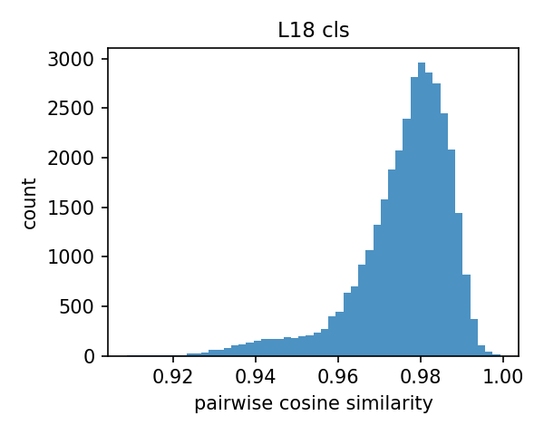<figcaption>L18 cls</figcaption></figure>
<figure><figcaption>L18 mean_patch</figcaption></figure>
<figure>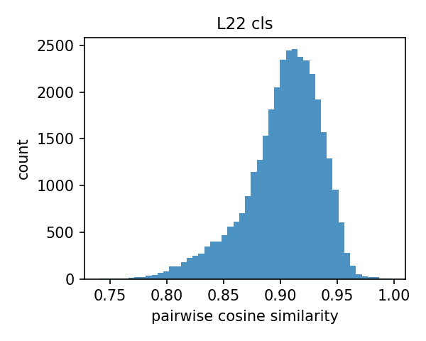<figcaption>L22 cls</figcaption></figure>
<figure><figcaption>L22 mean_patch</figcaption></figure>
<figure><figcaption>L24 cls</figcaption></figure>
<figure>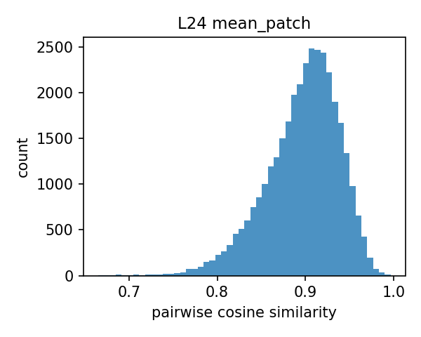<figcaption>L24 mean_patch</figcaption></figure>

Cosine similarity histograms per matrix (regenerated as individual panels for legibility)

**How to read these histograms:** each panel is a distribution of pairwise cosine similarity, computed over 500 random pairs of the 264 figures, for one layer/pooling matrix. The x-axis is similarity (1.0 = identical direction in embedding space, 0 = unrelated); the y-axis is how many of the 500 sampled pairs fall at that similarity level. This is purely a QC check, not a design-signal check: it confirms every matrix produces a normal-looking spread with no NaN/Inf, no exact-duplicate spike at 1.0, and no dead dimensions — nothing about *which aircraft look similar* is visible here. A histogram pushed close to 1.0 (e.g. layer 18 cls, mean 0.976) means most images sit close together in that space — little room left for real design differences to separate them. A wider, lower-mean spread (e.g. layer 24 cls, mean 0.43) means images are more spread apart — more room for genuine structure, but also where the embedding is most sensitive to noise. Whether that spread actually reflects real design signal (rather than noise) is what Sections 3–4 test quantitatively, not this QC step.

### 2.2 Sanity Check Validation

**Sanity Check Status: PASSED** — zero exact duplicates, zero dead/near-dead dimensions, zero NaN/Inf values across all 6 embedding matrices; cosine similarity distributions behave as expected per layer depth (near-1.0 early layers, wide spread at layer 24 cls).

---

## Section 3: Global Embedding Structure vs. Random Noise

REAL-VS-RANDOM TEST — PASSED

<strong>What this stage checks:</strong> whether the frozen DINOv2 embeddings encode genuine geometric structure, or are statistically indistinguishable from random noise — tested via PCA concentration and pairwise-distance comparison against a random baseline, across all 6 layer/pooling matrices.

**Status:** PASSED (real-vs-random test). **Core finding:** the embeddings clear the pipeline's threshold, proving they encode genuine geometric structure rather than statistical noise.

### 3.1 PCA Structure Across Layers 18–24, cls vs. mean_patch

| Layer | Pooling | PC1 variance ratio vs. random | Effective dim | Dims for 90% var |
|---|---|---|---|---|
| 18 | cls | 20.43× | 15.7 | 52 |
| 18 | mean_patch | 25.42× | 12.2 | 51 |
| 22 | cls | 22.01× | 20.2 | 61 |
| 22 | mean_patch | 26.57× | 12.1 | 57 |
| 24 | cls | 18.27× | 26.0 | 61 |
| 24 | mean_patch | **28.49×** | 12.1 | 57 |

`mean_patch` pooling consistently shows a stronger single dominant direction (higher PC1 ratio) than `cls`, while `cls` pooling spreads variance across more effective dimensions (higher participation ratio) — i.e. mean-patch embeddings are more concentrated, cls embeddings are more diffuse.

### 3.2 Pairwise Cosine Distance: Real Embeddings vs. Random Baseline

The pipeline's random baseline is a Gaussian-noise matrix of identical shape (N×1024) to each real embedding matrix; PC1 variance ratio (table above) is the primary real-vs-random test, all values comfortably clear the pipeline's >3× pass threshold.

**PCA spectrum, real vs. random (per layer/pooling):**

<figure><figcaption>L18 cls</figcaption></figure>
<figure>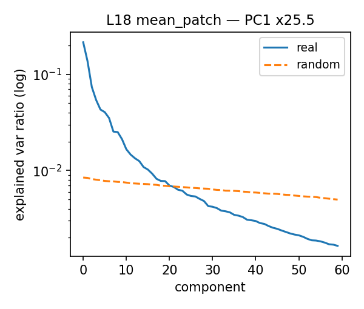<figcaption>L18 mean_patch</figcaption></figure>
<figure><figcaption>L22 cls</figcaption></figure>
<figure><figcaption>L22 mean_patch</figcaption></figure>
<figure>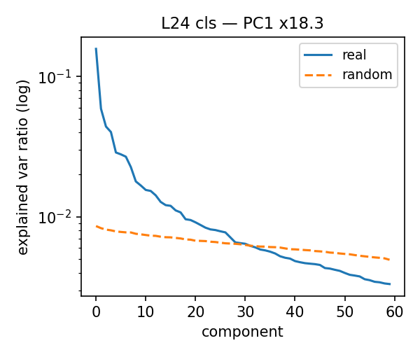<figcaption>L24 cls</figcaption></figure>
<figure><figcaption>L24 mean_patch</figcaption></figure>

**Pairwise cosine-distance distribution, real vs. random (per layer/pooling):**

<figure>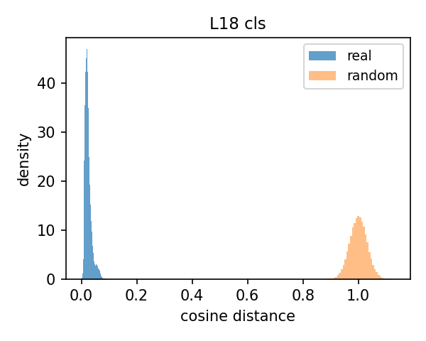<figcaption>L18 cls</figcaption></figure>
<figure><figcaption>L18 mean_patch</figcaption></figure>
<figure><figcaption>L22 cls</figcaption></figure>
<figure><figcaption>L22 mean_patch</figcaption></figure>
<figure><figcaption>L24 cls</figcaption></figure>
<figure>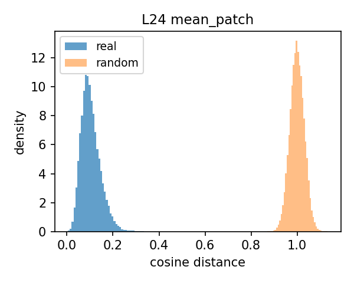<figcaption>L24 mean_patch</figcaption></figure>

### 3.3 Structural Integrity Conclusion

All 6 matrices pass real-vs-random on PC1 concentration (18–28× the random baseline) and show non-trivial local structure (Hopkins ≈ 0.66–0.72, i.e. clearly non-uniform but a smooth continuum rather than sharply separated islands). **Embeddings encode genuine geometric structure, not noise** — but that structure is closer to a continuum of drawing styles than to hard clusters, which sets expectations for Section 4.

---

## Section 4: Unsupervised Image-Level Clustering

CLUSTER↔TAXONOMY ALIGNMENT — PASSED

<strong>What this stage checks:</strong> whether unsupervised clustering of the embeddings recovers meaningful aircraft-design groupings, or just superficial drafting/applicant style — by clustering the reference matrix and testing which taxonomy attributes (vs. which confounds) best align with the resulting clusters.

**Status:** PASSED (cluster–taxonomy alignment). **Core finding:** unsupervised clustering successfully recovered meaningful aircraft-design groupings, with the best design attribute (`M3_emp_chord`) outperforming the tested confounds on raw NMI.

*Using layer 22, mean_patch pooling — the pipeline's configured reference matrix (Section 1.3).*

### 4.1 Hierarchical Dendrogram

Purpose: visualize how the 264 embedded architectures group hierarchically, as a first qualitative look before any cluster count is chosen.

Ward-linkage agglomerative clustering (`scipy.cluster.hierarchy`, `method="ward"`) over the 264-figure, layer-22-mean_patch matrix (reduced via PCA to 57 dims per Section 3):

<figure class="single">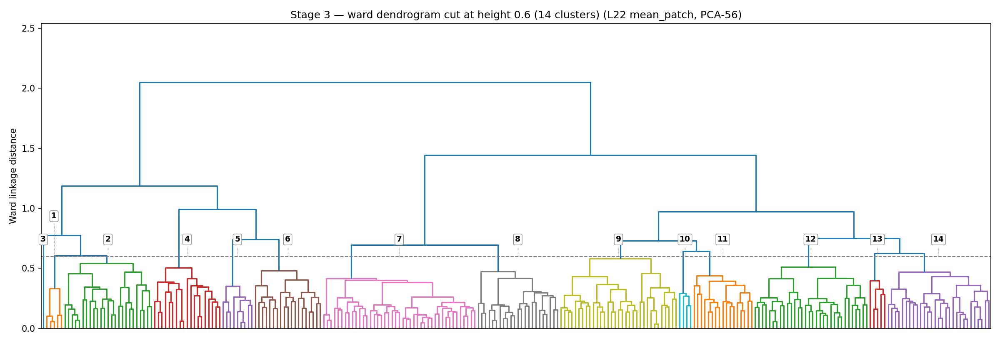<figcaption>Dendrogram, labeled 1–14 at the cut used for the branch folders below</figcaption></figure>

**Branch-level image folders:** the tree was cut at Ward linkage distance 0.60, which is where it splits into exactly **14 branches** (a strict cut at 0.47 gives 21 branches instead, since the natural split points on this tree don't line up with round numbers — 0.60 was chosen to hit 14 exactly). Each labeled branch above corresponds to a folder of that branch's actual main images, for visual auditing:

`docs/dendrogram_clusters/cluster_01/` … `cluster_14/`, one subfolder per branch, containing that branch's main-image files (branch sizes range from 1 to 43 images; exact counts in `cluster_sizes.json` in the same folder).

### 4.2 Dimensionality Reduction Comparison

Purpose: find and validate the actual cluster count/algorithm (k-means, agglomerative, HDBSCAN) that Sections 4.3–4.4 will test against the taxonomy.

This pipeline's UMAP is tuned via `n_neighbors=15` and `min_dist=0.1` (cosine metric). Two variants are run: (a) colored by unsupervised cluster assignment, and (b) colored by taxonomy attribute.

**UMAP colored by unsupervised cluster** (k-means k=2, and HDBSCAN):

<figure>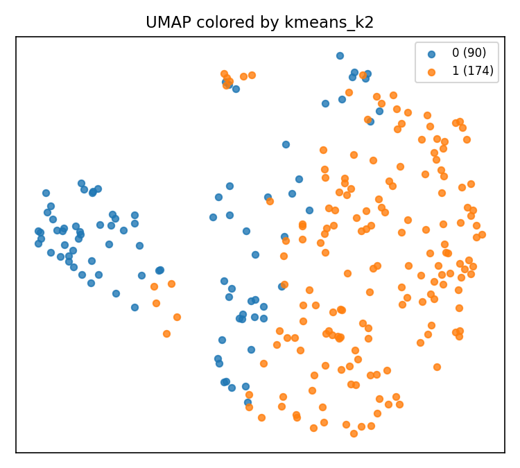<figcaption>UMAP — kmeans k=2</figcaption></figure>
<figure>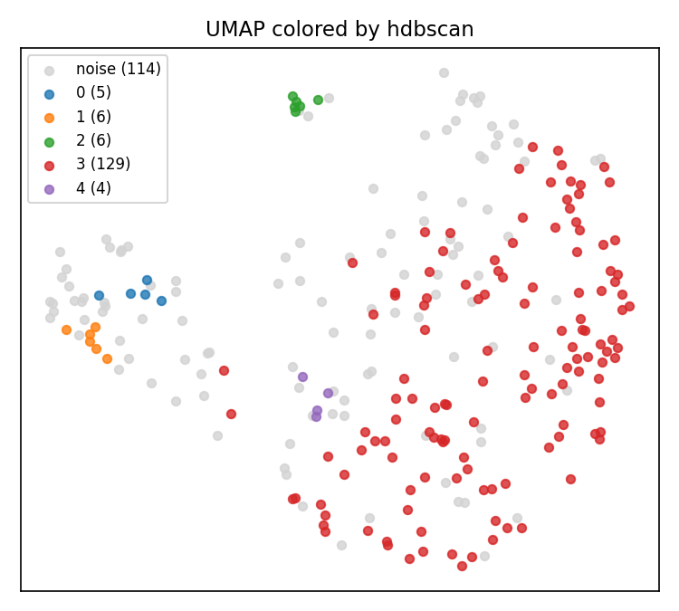<figcaption>UMAP — HDBSCAN</figcaption></figure>

**UMAP colored by taxonomy attribute** (`G1_topType`, `M2_wCount`, `M2_wingConf`, `M1_boomsPresent`, `M1_fusShape`, `M1_gearArch`):

<figure>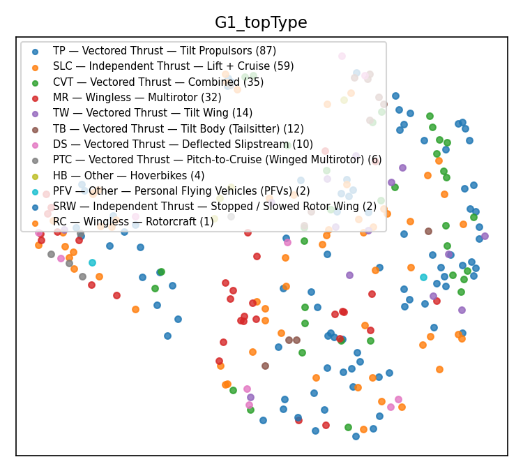<figcaption>G1_topType</figcaption></figure>
<figure><figcaption>M2_wCount</figcaption></figure>
<figure>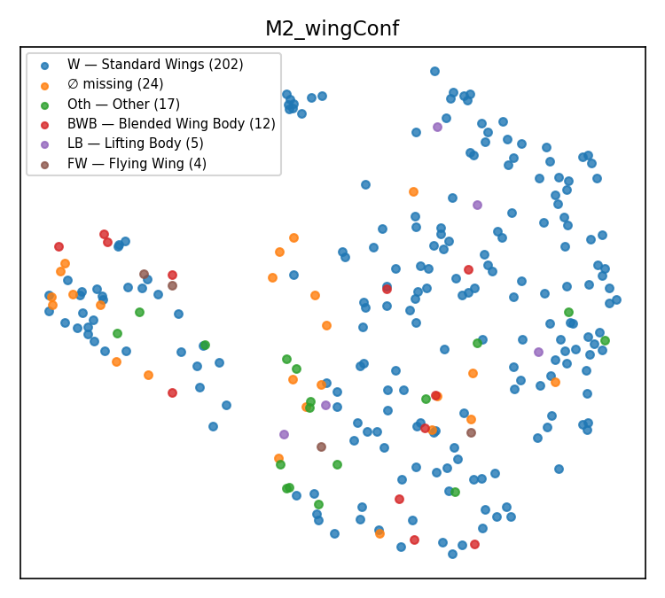<figcaption>M2_wingConf</figcaption></figure>
<figure><figcaption>M1_boomsPresent</figcaption></figure>
<figure><figcaption>M1_fusShape</figcaption></figure>
<figure>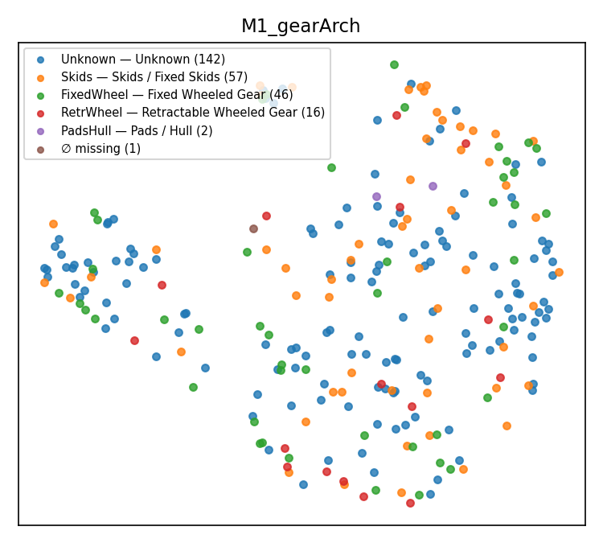<figcaption>M1_gearArch</figcaption></figure>

Best clustering result (k-means / agglomerative / HDBSCAN sweep, k=2..10): **agglomerative, k=2, silhouette 0.254** is the best overall; k-means k=2 is close behind (silhouette 0.197); HDBSCAN settles on 5 clusters with a higher noise fraction (0.432, silhouette 0.149) — i.e. density-based clustering finds more structure once every architecture is included, but at the cost of calling nearly half the dataset "noise." Bootstrap cluster stability (ARI) = 0.724 for the k-means k=2 partition (up from 0.70 in the main-arch-only run).

### 4.3 Cluster ↔ Taxonomy Alignment (architectures)

Purpose: the key confound test — check whether the clusters found in 4.2 track real design attributes more strongly than they track nuisance factors like applicant identity or drawing perspective.

Best-aligning taxonomy attributes to the 2-cluster (k-means) partition, by normalized mutual information (NMI), out of 79 attributes tested:

| Attribute | NMI | ARI (chance-corrected) | # categories / N | What it is |
|---|---|---|---|---|
| **M3_emp_chord** | **0.260** | 0.218 | 2 / 39 | Whether the empennage-mounted propulsor faces forward or back — puller ("Front") vs. pusher ("Back") configuration. |
| M3_emp_zone | 0.235 | 0.123 | 5 / 41 | Where on the empennage that propulsor sits — tip-mounted, stacked vertically, or stacked horizontally. |
| M3_boom_t2_count | 0.145 | −0.013 | 9 / 94 | Number of secondary (type-2) propulsion units mounted on the boom, per boom. |
| M2_wing1_posV | 0.139 | 0.210 | 4 / 211 | Vertical mounting position of the main wing on the fuselage — high/shoulder, mid, or low. |
| M1_boom1_circSym | 0.135 | 0.109 | 2 / 111 | Whether the primary boom is circumferentially symmetric (round cross-section) or not. |
| *assignee (confound)* | 0.207 | **0.036** | **109 / 264** | Patent applicant/company — a drafting-style confound, not a design attribute. |
| *drawing perspective (confound)* | 0.201 | 0.288 | 6 / 264 | The figure's viewpoint (front, side, top, isometric, ...) — reflects how the patent was drawn, not the aircraft's design. |
| *assignee_country (confound)* | 0.169 | 0.182 | 19 / 261 | Applicant's country of origin — another drafting/institutional confound. |

**Is any of this NMI just luck?** Because NMI is not chance-corrected, it automatically inflates when an attribute has too many small categories relative to its sample size. Cross-referencing NMI with the chance-corrected Adjusted Rand Index (ARI) exposes which signals are real and which are artifacts:

- **Assignee (statistical mirage):** having 109 distinct companies across only 264 patents (many appearing just once or twice) inflates its NMI to 0.207. However, its ARI is a mere 0.036, proving the real agreement with clusters is practically zero.
- **M3_boom_t2_count (false positive):** shows a positive-looking NMI (0.145) but a negative ARI (−0.013), meaning it actually aligns worse than random chance.
- **M3_emp_chord (real signal):** with only 2 categories over 39 patents, its ARI (0.218) closely tracks its NMI (0.260). There is no cardinality inflation here; the signal is legitimate.
- **Drawing perspective (genuine confound):** with only 6 categories, its ARI (0.288) is actually higher than its NMI (0.201). This is a genuinely strong relationship, not a mathematical artifact — and, being higher even than `M3_emp_chord`'s ARI, it's the one most worth explicitly controlling for before treating cluster membership as a clean design signal (see next steps).

### 4.4 Intra- vs. Inter-Class Distances (Notebook Stage 5 — layer comparison)

Purpose: a finer-grained, per-attribute test (independent of any specific cluster count) of whether same-class patents sit closer together in embedding space than different-class patents, and which layer/pooling separates classes best.

`tax.stage5_distances` tests, per taxonomy attribute and per layer×pooling matrix, whether within-class cosine distance is smaller than between-class distance (separation ratio, Cohen's d, permutation p-value). Across all 264 figures × 79 attributes tested (492 attribute×layer rows total): **174 rows separate significantly at p < 0.05** (excluding the `cluster` label itself).

Top individual separations found (excluding the `cluster` label itself):

| Attribute | Layer | Pooling | Separation ratio | Cohen's d | p-value |
|---|---|---|---|---|---|
| **M1_boom1_circSym** | 22 | mean_patch | 1.543 | 1.248 | 0.001 |
| M1_boom1_circSym | 22 | cls | 1.412 | 1.149 | 0.001 |
| M1_boom1_circSym | 24 | mean_patch | 1.423 | 1.031 | 0.001 |
| M1_boom1_circSym | 18 | mean_patch | 1.415 | 0.911 | 0.004 |
| M3_core_layout_zone | 22 | cls | 1.146 | 0.735 | 0.005 |
| M3_wing1_chord | 22 | cls | 1.263 | 0.726 | 0.009 |

For reference, the unsupervised `cluster` label itself separates most strongly of anything tested on its own reference matrix (layer 22 mean_patch: ratio 1.560, d = 1.03, p = 0.001) — expected, since clustering is fit directly on that matrix.

Averaging Cohen's d over all significant rows per layer×pooling, **layer 22 cls** now has the highest average effect size (mean d = 0.363), ahead of layer 22 mean_patch (0.315) and the other four matrices (0.26–0.30) — a change from the main-arch-only run, where layer 24 cls and layer 18 mean_patch led. With the full architecture set, layer 22 is the strongest performer under both pooling strategies.

<figure class="single"><figcaption>Separation heatmap</figcaption></figure>

---

## Section 5: Phase Progress & Next Steps

SUMMARY — IN PROGRESS

<strong>What this section is for:</strong> not a new test — it rolls up the pass/fail results from Sections 1–4 into an overall phase status and lists the concrete next steps still open.

**1. Data preprocessing & taxonomy checks — robust.** Two batches (531 approved patents combined), full review/duplicate tracking, zero embedding QC failures (no corrupt/duplicate/dead vectors across 6 layer×pooling matrices, now covering all 264 embedded architectures rather than one per patent). Taxonomy schema (G1/M1/M2/M3 attribute groups, 256 attributes) is wired end-to-end from Excel review sheets through to cluster-alignment testing.

**2. Embeddings show real, non-random geometric structure** (PC1 18–28× random baseline, Hopkins 0.66–0.72) — sufficient to proceed to deeper unsupervised production pipelines. Embedding every architecture (not just each patent's main one) improved the downstream result: the clearest 2-way partition (k-means, silhouette 0.197, stable ARI 0.724) now aligns with a genuine design attribute (`M3_emp_chord`, NMI 0.260) more strongly than with any confound tested (best confound: applicant identity, NMI 0.207) — reversing the earlier caution, where a confound had outranked every real attribute. Layer 22 mean_patch remains the configured reference matrix for clustering and alignment.

**Immediate next steps:**

**1. Fill baseline comparison gaps.** Complete the layer matrix table: populate the "Best clustering silhouette" and "Cluster → taxonomy alignment (best NMI)" columns for the other 5 candidate layer/pooling configurations in Section 1.3. Currently they are only computed for the reference matrix (layer 22, mean_patch), leaving the baseline comparison incomplete.

**2. Address clustering weaknesses.**
- Optimize HDBSCAN hyperparameters: fine-tune the density-based clustering parameters to reduce the high noise fraction (43.2%), which currently discards nearly half the dataset.
- Implement confound control: explicitly apply residualization to the embeddings before clustering. While the design attribute `M3_emp_chord` (NMI 0.260) beats the confounds on NMI, applicant identity (NMI 0.207, ARI 0.036) and especially drawing perspective (NMI 0.201, ARI 0.288) are strong enough to distort the unsupervised groupings.

**3. Integrate missing data breakdowns.** Add the architecture-type breakdown table: formally generate and embed the table mentioned earlier in these next steps, using the data from `stage0/coverage_table.csv`.

Also worth auditing while this is fresh: the 14 dendrogram branches now each have their own image folder (Section 4.1) — a visual check of whether same-branch images actually look like the same design family would validate (or challenge) the quantitative clustering results above.

---

All tables/figures sourced from <code>DINOv2_eVTOL_frozen_Analysis/notebooks/11_taxonomy_structure_separation.ipynb</code> and its outputs in <code>.../Preliminary_analysis/outputs/analysis_taxonomy/</code>.
